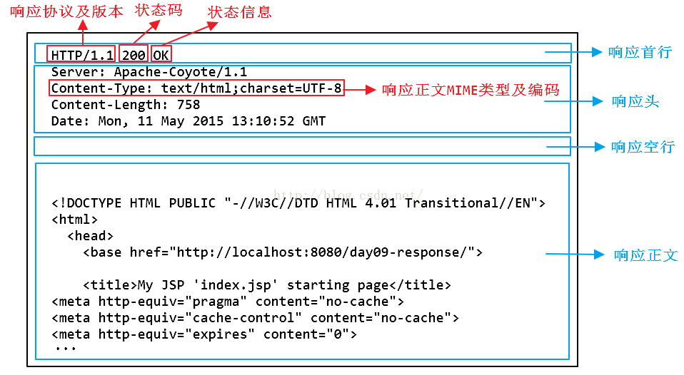

# http 报文结构

http报文有请求报文和响应报文两种。这两种报文都有四部分组成：***请求首行，请求头，空行，请求正文。***

## 请求首行

### 请求报文的请求首行

请求报文的请求首行也叫请求行，由 ***请求方法、[空格]、URL、[空格]、HTTP版本*** 组成。如下图所示：


``` http
请求方法：向请求资源指定的资源发送请求报文的方法，其作用是可以指定请求的资源按期望产生某种行为。
URL : 链接
HTTP版本：目前有 HTTP/1.0、HTTP/1.1、HTTP/2.0 版本，其中 HTTP1.0 版本使用较广泛。
```

### 响应报文的请求首行

响应报文的请求首行也叫响应行，由 ***HTTP版本、[空格]、状态码*** 组成。如下图所示：


## 请求头

请求头是用来说明浏览器、服务器或报文主体的一些信息，可以有好几行，也可以不使用。每个请求头都由 ***首部字段名、[空格]和值*** 组成。每个请求头在结束地方都有CRLF(『回车』和『换行』符)。

HTTP首部字段分为4中：***通用首部字段，请求首部字段，响应首部字段，实体首部字段。***


## 请求正文

在请求报文中，一般是 post/put 提交的表单信息。与请求头之间有 CRLF 即空行。



